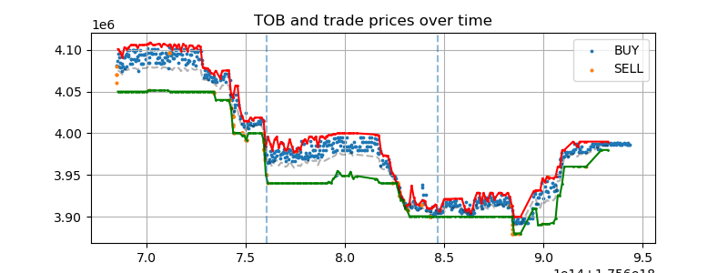
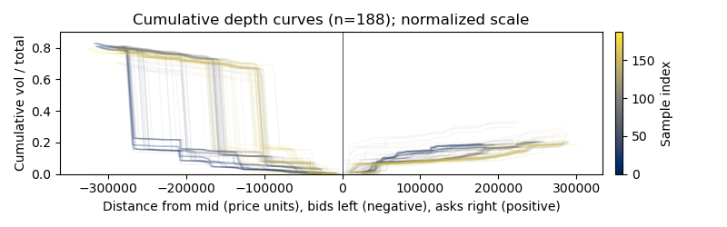
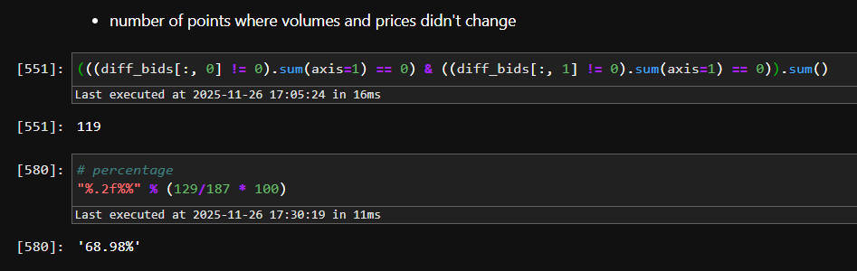
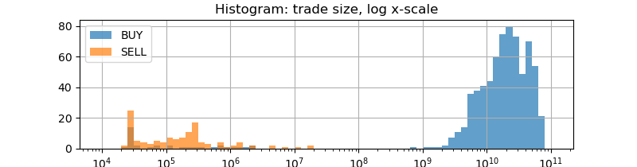
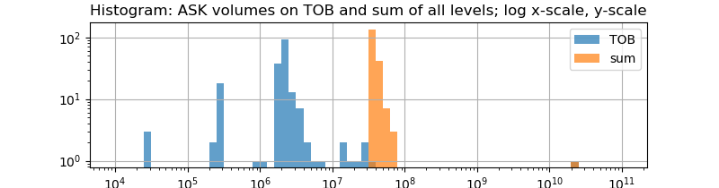
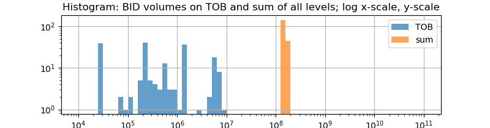
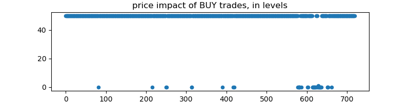
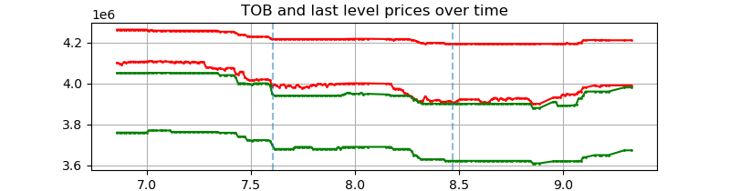

# 1. Data source considerations  

## First and foremost observation  

- 1) Sparse data with **unsignificant amount of ticks**. This complicates applying common statistical tools and assumptions.  
The minimal time gap between OB updates is around 1091 seconds, which is a lot.

```
Orderbook ts count by days:	64, 68, 56, 
Trades ts count by days:	273, 274, 298,
```


Historical trades from Binance can be downloaded at:
https://data.binance.vision/?prefix=data/spot/daily/aggTrades/ETHBTC/  
Number of daily entries there ranges from 43k to 79k, which is several orders of magnitude larger than all data points in the task dataset (<1k).  
Which makes it doubtful to assume that such data is a *real data feed from an actual exchange*, because such a low activity would be not sustainable for the exchange to maintain operation on this pair.  
Also it appears that ETHBTC pair isn't present even on some large CEXs.  


## Observations on data which look unnatural:

- 2) Almost all trades occur above the midprice but below best ask. (Also this majority is BUY trades). *See 2.3 in the notebook.*  
Normally, trades should probably occur closer to TOB than it appears here.  




> Adding this to the above, one can suspect **possible data manipulation** (possibly undersampling).    

- 3) The orderbook is heavily imbalanced toward the BUY side, which contradicts the price mainly moving down over the period presented. *(2.4)*  




- 4) There are several areas on the TOB shape over time which look unnaturally flat. Even when the other side might move in a more or less natural manner.  


## Observation from comparing the price movements to ETHBTC plot from Binance:

- The spread is large when compared even to candlestick plot from Binance for that time period. (This is apparent even by glancing at the plots, without computing the bps values. The candlestick provides resolution up to 15 min, and for each candle one can expect that the spread at any time moment within is bound by the candle swing, but typically should be much smaller by some orders of magnitude.)  

> This (combined with point 2 from above) is another signal to suspect that the **data have been manipulated**: maybe some adaptive number of top levels where removed for several timeranges to produce such a flat profile.  

A proper comparison would require having similar data piece from a large exchange, but it appears impossible to find free full-orderbook historical updates. (Or even TOB-only).


## Some other small observations:

- 1.1 Significant portion of bids (~69%) doesn't introduce any updates to the previous tick  *(2.6*)

- 1.2 Almost a half of ticks (~44%) update only the best level of asks  

> This also hints at probability of an **incoherent data nature**.  

- 2) An abnormal volume value is present at one tick in top ask level, which is >2 orders of magnitude higher than typical. The nature of this outlier is unclear

<br>
<br>


# 2. Taking the data at face value

After all of the above considerations, leaving the inconsistent characteristics of the data aside, some "as-is" research showed the following.

- There's a chunk of 'BUY' trades which have volumes several orders of magnitude larger that the rest.  *(Plots below or 2.8)*





- - Applying such trades to present orderbook **would wash away all levels most of the time with overshoot** of 1-2 orders of magnitude *(2.9)*  



- - Level 50 is several times more distant from the TOB than the other side TOB, thus such trade should be resulting in an extreme price swing, which apparently do not happen in this dataset.  



- - - This group of trades (>10<sup>8</sup>) is either erroneous or completely unrelated to orderbooks  


- Even using Benford's law isn't necessary to see the unfitting nature of the bloated trades. And the number of points is rather insufficient to use this statistic anyways.  
(https://dn.institute/research/market-health/docs/benford/)


> All of the above suggests that part of the trades data is either **erroneous or constructed artificially**

> Also **OB data has been tampered**

<br>
<br>

- - -

Some further research may include comparing the data to historical klines for this instrument, and also taking a look at prices of ETH and BTC in USDT. (Even though such comparison is only relevant for non-tampered data)